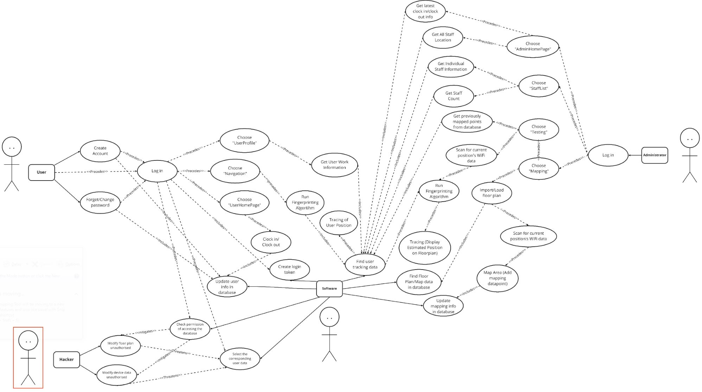

# **Staffhub - Indoor Wifi-based Location Tracking**

## **Contributers**
Goh Shao Cong Shawn  
Pang Zichen  
Seah Qi Yan  
Tjoa Jing Sen  

## **1 | Overview**
### **Context**  
The objective of this project is to create a hotel staff management app (which we named StaffHub) that utilises WiFi indoor positioning technologies through received signal strength indication (RSSI). As a basic function, this app serves to quickly track the number as well as location of staff within the hotel building, coupled with a clock-in/out and navigation function to track staff movement and activity. Furthermore, this app serves to aid in search and rescue in the event of an emergency (e.g. fires, terrorist attacks), to track staff numbers and location within the location as the staff are often tasked to first clear guests from the hotel and thus the last to leave. How it works is as such:

1. An indoor positioning algorithm is developed that leverages WiFi Access Points (APs) available within the hotel/location, adapted from the popular Fingerprinting Algorithm.

2. The Staff Administrator will be able to utilise the app to map the WiFi data of predetermined work areas that utilises Android’s in-built WiFi Scanning capabilities. From the wifi data obtained at each point on the floor plan, a datapoint is created in our database storing the MAC addresses and respective WiFi RSSI values of nearby APs. This dataset then serves as input sample data in our positioning algorithm. This is also known as the mapping function. The mapping function can be repurposed across any floor plans that are input to the app through the database.

3. The testing function of the app allows the administrator to test the accuracy of their mapping by scanning the administrator’s surrounding WiFi. The app then feeds that data as input to our positioning algorithm. The algorithm performs calculations against the existing data of mapped locations.It then displays an indicator on the floor plan within the app, predicting the location of the administrator who is conducting the test.

4. For the user (staff), they would utilise the app’s clock in, clock out function to replace the need to manually cluster together at designated entry points. The app is left running in the background for the duration of their shift and the staff would then clock out afterwards, there is then an automatic calculation of the staff’s hours worked added to their timesheet, as well as their salary earned per month based on the staff’s hourly rate. 

5. The user can also utilise the navigation function within the app to locate themselves within a particular floor of a work area. The navigation function works similarly to the administrator’s testing function which takes in the WiFi data of the user’s current position and runs it through our positioning algorithm. In this case, the staff’s location would also be updated within the database and shown on the administrator’s overview of the floorplan which shows the staffs’ most recent location within the work area. 

## **2 | Design**
### **Use Case Diagram**  
For more clearer view of our use case diagram, please visit the link below:   
https://whimsical.com/VveJp7UWgrZk9Kyde9nbC4@3CRerdhrAw7dgH4HXCh4MFKC

### **Sequence Diagram**
For more interactive sequence diagrams, please visit the link below:   
https://whimsical.com/VveJp7UWgrZk9Kyde9nbC4@3CRerdhrAw7dgH4HXCh4MFKC 

### **Class Diagrams**
For more interactive class diagrams, please visit the link below:   
https://whimsical.com/VveJp7UWgrZk9Kyde9nbC4@3CRerdhrAw7dgH4HXCh4MFKC 

## **3 | Implementation Challenges**
### **Algorithmic Challenges**
#### **Formulae Constraints**
Our algorithm was adapted from a research paper found on indoor positioning using the fingerprinting algorithm. However, we found from testing our algorithm that the results were highly susceptible to inaccurate data points, which is quite common in the use of WiFi data retrieved from the Android WiFi Scanner. Thus, upon inspection of the algorithm within the research paper, we found that the original algorithm given considers the WiFi APs of all datapoints which contain the same AP as detected at the user’s current location, even from data points much further away from the user as long as they had the same BSSID/MAC address. This severely impacted the accuracy of our testing results whereby results would be accurate sometimes, and completely inaccurate on other times. Hence, we made the following change to the original algorithm mentioned in the research paper:

As seen above, rather than taking all RSSI values of identical BSSID WiFi AP addresses detected at the user’s location and within the database of previously mapped data points, we would first run a percentage checker method which computes the percentage similarity between the WiFi data at the user’s location as well as the data points in the database. This allows for only the top 3 data points with highest percentage similarity to be included in our computation of euclidean distance and thus estimation of the user’s coordinates on the map.

However, upon further testing with this improved algorithm, we found that there were occurrences whereby several data points in the database which actually scored 100% similarity to the user’s location WiFi data due to the difference in their WiFi AP RSSI values being within the threshold which we set (which was already very stringent at 5 dbm). However, despite the 100% similarity, some data points that passed the similarity checker were actually not the nearest datapoint to the user’s location but were selected as the top 3 to predict user coordinates, causing other data points which were nearer to the user’s actual location to be unintentionally ignored. This caused our results to still be slightly inaccurate due to the wrong prioritisation of data points to be used in the final step of the algorithm. Hence, we then decided to introduce an additional and final filtering before computing Euclidean distance and generating the user’s position coordinates, which can be seen in the method below:  

Hence, the initial topKPercentage method defined was modified such that the top five data points with the highest percentage similarity to the user’s current location’s WiFi data would be used in the estimateCoordinates method. Within estimateCoordinates itself, we would then perform further filtering by first computing the Euclidean distance from each of the five data points to the user’s current location, sorting the distances in ascending order, then obtaining the top 3 data points nearest to the user’s current position to perform estimation of coordinates to display the user’s current location on the floor plan within the map. This final improvement proved to be most effective and led to a very high level of accuracy in our positioning algorithm such that the predicted position of the user would be within 2 metres of their actual position on the floor plan.

#### **Material/Resource Constraints**
While conducting mapping to test the accuracy of the positioning algorithm, we realised that the floor plans we had been given were not completely accurate. Many identifiable objects/landmarks on the floor plan were not to scale, especially the ceiling fans which we relied on heavily to position ourselves for mapping. Since these landmarks we relied on deviated from their positions in the floor plan in reality, we had to do some estimations in dropping our positioning pins, which could have caused the coordinates of the mapped data points in our database to be less accurate, which can negatively impact the results of our positioning algorithm. Thus, the results of the user’s position coordinates reflected on the app may seem less accurate than they actually are. Hence, after realising that such a scaling error exists, we relied on the landmarks on the map to a lesser extent, and also paid closer attention to our relative position within the floorplan to the actual scale of the mapping area, which did make our algorithm results more accurate. 

## **Engineering Challenges**
### **Wifi Scanning Consistency**
Our app and client require the use of wifi RSSI values as input to our fingerprinting algorithm to map an individual’s location. This proved to be a slight challenge due to the android environment. Since Android 9, the WifiManager in the android library prevents apps from making continuous requests to scan the device’s current Wifi data, such that non-Android permitted applications are not allowed to access the device’s location services in the background, and can only run four Wi-Fi scans every two minutes due to the Wifi scan throttling. We attempted to circumvent this by enabling developer settings when running the app on our own android devices for testing, however, there still appeared to be some limitations or throttling on the number of scans that we could run on the app. Hence, we had to take these restrictions into account when running the mapping and testing functions of our app, which we tried to notify users of through using toasts that introduced a pause between each Wifi scan. 

Furthermore, during our frequent review/check-in sessions with our client, we had received many helpful tips and advice regarding Wifi scanning methods in Android. For example, we had observed a phenomenon whereby if a mapping/testing was done almost immediately after the previous mapping/testing, the Wifi Manager would often return the same Wifi data from the previous mapping/testing method call rather than run a new scan and return the results. Upon sharing this with our client, he mentioned coming across a similar issue whereby Wifi Managers would return previously stored Wifi data if the same Wifi Manager methods are called within a certain time frame. Hence, it was reassuring to learn that this was a Java SDK limitation that we took into account when conducting the mapping and testing functions of our app. Thankfully, with greater awareness of these limitations, we were able to more effectively utilise the in-built Wifi Manager methods for our app functions. 

### **Hardware Limitations/Location Constraints**
When conducting WiFi scanning tests around our test areas in school, we realised that the WiFi data obtained for the same location had slight variations due to factors such as height of holding the phone, or direction which the user is facing when scanning. Fortunately, these slight differences did not affect the accuracy of our algorithm very severely, but we learnt to take such considerations into account to standardise the method of mapping and testing within the app. However, when researching more on the matter of discrepancies in WiFi scanning data, we found out that conducting mapping near large bodies of inorganic material, especially metals and glass, caused WiFi RSSI readings to be reduced as compared to an area without such obstructions/influences. While we have taken measures to account for these deviations in the algorithms and calculations, such as by increasing mapped points near such ambiguous areas, it does increase the level of error in positioning, especially if work areas contain such materials that affect WiFi scanning on Android devices. Thus, while we did attempt to mitigate the impacts of such factors, these are location constraints and hardware limitations of WiFi technology that are difficult to predict or prevent entirely. 

## **Testing Challenges**
### **Performance Testing**
Performance testing refers to the testing of the fingerprinting algorithms accuracy. This testing is completely manually done, resulting in it being time consuming. Each mapping of a 40m by 20m floor plan could take up to 30 mins, which then had to be tested at as many spots as possible to see if the mapping was done accurately. Furthermore, before the algorithm was made acceptable, we were unable to tell if a failure to achieve accurate positioning was due to poorly done mapping or just an inadequate or logically flawed algorithm. It took an even greater deal of time doing trial and error to figure out what errors there were. Finally, the layout of the areas mapped, and the physical conditions of the surroundings mattered as well. Accuracy seems to dip when near large bodies of heavy metal, such as lift waiting bays. A potential solution could be to combine bluetooth signalling to replace the RSSI signals of WiFi scanning when the RSSI values are deemed to be too weak.

### **Unit Testing**
The unit testing in the android programming system is quite limited. In our project, the implementations of most features are related to android context, which is usually potentially related to other features. However, in unit testing, features under testing are not allowed to connect with other components since an independent environment is needed. Therefore, in the project, only features like some utils and data classes are tested by unit testing. For other components, instead, instrumented testing is applied.

### **Instrumented Testing**
Instrumented testing simulates operations of users and matches the content displayed on the screen with the expected value. However, actions on specific views are still limited. For example, to test the image dot layout, a test case should contain simulations touching a specific position on the screen, but there’s no such existing ViewAction provided. Hence, we defined a custom ViewAction click method that takes in the percentage coordinates of the click scaled to the actual size of the View being clicked, as referenced from Stack Overflow, shown below.

While we were still able to carry out Instrumented tests on most of our app’s UI, this ViewAction method was vital for testing our mapping function within the ChildMappingFragment to ensure that tapping a specific location on the floor plan would generate a datapoint in the database of the same coordinates and resultant WiFi scan data.

Additionally, since our app’s key functions of mapping (and testing) are reliant on the WifiManager (repackaged as WifiScanner for custom methods by us) which is a component of the SDK and its methods cannot be accurately replicated using Espresso alone. Thus, we also turned to picking up Mockito in order to ‘mock’ the result from method calls from our WifiScanner class to be received in the ChildMappingFragment, allowing us to test the mapping function of our app. 

## **4 | Testing**

### **Performance Testing**

The key feature of the application program is the accuracy of the fingerprinting algorithm. To test the performance of the indoor positioning algorithm we did many mapping and testing in multiple places and observed the performance in different locations of multiple buildings. 

Location of Fingerprints on Accuracy

At each location, mapping was done in intervals of 5 to 10 metres and testing was conducted at 30 spots to ensure coverage of the floorplan was diverse and extensive. The table below shows the different accuracies of the algorithm at different locations. Should the point be within 1 metre of where current position is, it is accorded a 100% score. 1 to 3 metres gives it 95%, and so on. Overall accuracy is obtained by multiplying each predicted point with its score and dividing total score by number of points taken.

<table>
  <tr>
   <td>
   </td>
   <td rowspan="2" >Within 1 metre

100%
   </td>
   <td rowspan="2" >1 to 3   metres

95%
   </td>
   <td rowspan="2" >3 to 5   metres

90%
   </td>
   <td rowspan="2" >5 to 10 metres

80%
   </td>
   <td rowspan="2" >Above 10 metres

0%
   </td>
   <td rowspan="2" >Overall Accuracy
   </td>
  </tr>
  <tr>
   <td>Area
   </td>
  </tr>
  <tr>
   <td>Auditorium
   </td>
   <td>3
   </td>
   <td>9
   </td>
   <td>11
   </td>
   <td>5
   </td>
   <td>2
   </td>
   <td>85%
   </td>
  </tr>
  <tr>
   <td>Building 2 Level 1
   </td>
   <td>2
   </td>
   <td>11
   </td>
   <td>13
   </td>
   <td>3
   </td>
   <td>0
   </td>
   <td>92%
   </td>
  </tr>
  <tr>
   <td>Campus Centre Level 1
   </td>
   <td>3
   </td>
   <td>5
   </td>
   <td>10
   </td>
   <td>6
   </td>
   <td>6
   </td>
   <td>72%
   </td>
  </tr>
  <tr>
   <td>Campus Centre Level 2
   </td>
   <td>4
   </td>
   <td>20
   </td>
   <td>6
   </td>
   <td>0
   </td>
   <td>0
   </td>
   <td>95%
   </td>
  </tr>
</table>

There are two main points to note here. The first is the issue with vertical distance. The lower overall accuracy of the Auditorium is due to the area being uneven in ground level. About 30% of the entire area is steps that lead upwards to the next floor. Most of the inaccurate predictions come from doing testing on the steps, revealing to us that the algorithm does not perform well when the height at which testing is done varies greatly.

Second is that the nearby materials surrounding a fingerprint affects accuracy. For Campus Centre Level 1, the most inaccurate points were due to fingerprints taken near the heavy metallic lifts. Additionally, this region of the Campus Centre RSSI was particularly weak, causing the measured accuracy to be poor in the area.

A solution we had was to increase the number of fingerprints taken in this particularly weak area. Approximately 20 additional fingerprints were taken, causing accuracy to improve.

<table>
  <tr>
   <td>
   </td>
   <td rowspan="2" >Within 1 metre

100%
   </td>
   <td rowspan="2" >1 to 3   metres

95%
   </td>
   <td rowspan="2" >3 to 5   metres

90%
   </td>
   <td rowspan="2" >5 to 10 metres

80%
   </td>
   <td rowspan="2" >Above 10 metres

0%
   </td>
   <td rowspan="2" >Overall Accuracy
   </td>
  </tr>
  <tr>
   <td>Area
   </td>
  </tr>
  <tr>
   <td>Campus Centre Level 1
   </td>
   <td>4
   </td>
   <td>9
   </td>
   <td>24
   </td>
   <td>11
   </td>
   <td>2
   </td>
   <td>86%
   </td>
  </tr>
</table>

Interval of Fingerprints on Accuracy

The smaller the interval between fingerprints collected during mapping, the greater the overall accuracy. The table below shows how the intervals between each fingerprint affect overall accuracy. A smaller mapping interval would mean more mapping points needed to cover the same area, so the mapping interval of 3 to 4 metres resulted in 50 fingerprints but 16 to 20 metres only had 12 fingerprints.

<table>
  <tr>
   <td>Campus Centre Level 2
   </td>
   <td rowspan="2" >Within 1 metre

100%
   </td>
   <td rowspan="2" >1 to 3   metres

95%
   </td>
   <td rowspan="2" >3 to 5   metres

90%
   </td>
   <td rowspan="2" >5 to 10 metres

80%
   </td>
   <td rowspan="2" >Above 10 metres

0%
   </td>
   <td rowspan="2" >Overall Accuracy
   </td>
  </tr>
  <tr>
   <td>Mapping Interval
   </td>
  </tr>
  <tr>
   <td>3 to 4 metres
   </td>
   <td>6
   </td>
   <td>36
   </td>
   <td>7
   </td>
   <td>1
   </td>
   <td>0
   </td>
   <td>95%
   </td>
  </tr>
  <tr>
   <td>5 to 10 metres
   </td>
   <td>1
   </td>
   <td>7
   </td>
   <td>12
   </td>
   <td>6
   </td>
   <td>1
   </td>
   <td>86%
   </td>
  </tr>
  <tr>
   <td>11 to 15 metres
   </td>
   <td>0
   </td>
   <td>3
   </td>
   <td>9
   </td>
   <td>10
   </td>
   <td>5
   </td>
   <td>70%
   </td>
  </tr>
  <tr>
   <td>16 to 20 metres
   </td>
   <td>0
   </td>
   <td>1
   </td>
   <td>2
   </td>
   <td>5
   </td>
   <td>4
   </td>
   <td>56%
   </td>
  </tr>
</table>
As can be seen, greatest overall accuracy was achieved with a smaller interval. It must be noted that too small an interval might also be averse to accuracy, since the fingerprints might overlap and interfere with one another, though this has not been tested. It is best to ensure the interval is no smaller than 3 metres.

Overall

While performing mapping with an interval of 3 to 4 metres on a floor plan that is mostly flat and away from exceeding large bodies of RSSI interfering material, the fingerprinting algorithm is able to achieve highly accurate predictions that are mostly within 3 metres of the actual location.

### **Unit Testing**

#### Tools used  

1. **JUnit 4** is used to do unit testing.

<table>
  <tr>
   <td>
<strong>Feature Tested</strong>
   </td>
   <td><strong>Processes used for testing</strong>
   </td>
   <td><strong>Findings</strong>
   </td>
  </tr>
  <tr>
   <td>Activity Log Class
   </td>
   <td>
<ol>

<li>Initialize with default constructor

<li>Initialize with null parameters

<li>Initialize with empty string
</li>
</ol>
   </td>
   <td>
   </td>
  </tr>
  <tr>
   <td>Data Point Class
   </td>
   <td>
<ol>

<li>Initialize with default constructor

<li>Initialize with constructor with no parameters

<li>Initialize with constructor with data point instance parameters
</li>
</ol>
   </td>
   <td>Fixed a bug in constructor with data point parameters: Calling wrong method
   </td>
  </tr>
  <tr>
   <td>User Class
   </td>
   <td>
<ol>

<li>Initialize with default constructor

<li>Initialize with constructor with no parameters

<li>Initialize with invalid email string

<li>Initialize with constructor with user instance parameters

<li>Test setter

<li>Test default values
</li>
</ol>
   </td>
   <td>
   </td>
  </tr>
  <tr>
   <td>Fingerprinting Algorithm
   </td>
   <td>
<ol>

<li>Get flag

<li>Sort Mac
</li>
</ol>
   </td>
   <td>
   </td>
  </tr>
</table>

### 

### **System/Integration Testing**

#### Tools used  

1. **Espresso**, an Android automated testing framework, is used in system testing to demo user’s operations. In system testing black-box testing scenario is applied.
2. **Junit 4 **was also used for system testing
3. **Mockito** was used for testing of UI (ChildMappingFragment)  that relied on components such as WifiManager in Android SDK

<table>
  <tr>
   <td>
<strong>Feature Tested</strong>
   </td>
   <td><strong>Processes used for testing</strong>
   </td>
   <td><strong>Findings</strong>
   </td>
  </tr>
  <tr>
   <td colspan="3" >Admin
   </td>
  </tr>
  <tr>
   <td>Admin Home
   </td>
   <td>
<ol>

<li>Change fragment in specific order

<li>Change fragment in random order
</li>
</ol>
   </td>
   <td>
   </td>
  </tr>
  <tr>
   <td>Misc Admin Page
   </td>
   <td>
<ol>

<li>Log out

<li>Change spinner element
</li>
</ol>
   </td>
   <td>
   </td>
  </tr>
  <tr>
   <td>Mapping Page
   </td>
   <td>
<ol>

<li>Change spinner element

<li>Mapping a point by tapping on the floorplan and clicking the scan and confirm button
</li>
</ol>
   </td>
   <td>Implemented default datapoint values to prevent invalid data formats from crashing the app
   </td>
  </tr>
  <tr>
   <td>Testing Page
   </td>
   <td>
<ol>

<li>Change spinner element
</li>
</ol>
   </td>
   <td>
   </td>
  </tr>
  <tr>
   <td>Staff Page
   </td>
   <td>
<ol>

<li>Enter Review Page by clicking items

<li>Click manage button to display review window

<li>Set valid pay rate in review window

<li>Set invalid pay rate in review window
</li>
</ol>
   </td>
   <td>Fixed bug of invalid pay rate: pay rate must be numeric
   </td>
  </tr>
  <tr>
   <td colspan="3" >User
   </td>
  </tr>
  <tr>
   <td>User Home
   </td>
   <td>
<ol>

<li>Change fragment in specific order

<li>Change fragment in random order
</li>
</ol>
   </td>
   <td>
   </td>
  </tr>
  <tr>
   <td>Profile Page
   </td>
   <td>
<ol>

<li>Log out
</li>
</ol>
   </td>
   <td>
   </td>
  </tr>
  <tr>
   <td colspan="3" >Other
   </td>
  </tr>
  <tr>
   <td>Splash Screen
   </td>
   <td>
<ol>

<li>No login

<li>Admin account login

<li>User account login
</li>
</ol>
   </td>
   <td>
   </td>
  </tr>
  <tr>
   <td>Sign In
   </td>
   <td>
<ol>

<li>Valid user login/Valid admin login

<li>Valid user with wrong password login until limit

<li>Valid admin with wrong password login

<li>Invalid email
</li>
</ol>
   </td>
   <td>
   </td>
  </tr>
</table>

### **Robustness Testing**

#### Tools used  

1. **Monkey**: In the project, an android testing framework Android Monkey which is a python-based testing script process was run by simulating random user operations to test the robustness of the application which means seeing whether the application or system will crash.

    Parts of the testing logs:
    :Monkey: seed=1619105076428 count=1000  
    :AllowPackage: com.example.blewifiterm5project  
    :IncludeCategory: android.intent.category.LAUNCHER  
    :IncludeCategory: android.intent.category.MONKEY  
    // Event percentages:  
    //   0: 15.0%  
    //   1: 10.0%  
    //   2: 2.0%  
    //   3: 15.0%  
    //   4: -0.0%  
    //   5: -0.0%  
    //   6: 25.0%  
    //   7: 15.0%  
    //   8: 2.0%  
    //   9: 2.0%  
    //   10: 1.0%  
    //   11: 13.0%  
    :Switch: #Intent;action=android.intent.action.MAIN;category=android.intent.category.LAUNCHER;launchFlags=0x10200000;  component=com.example.blewifiterm5project/.SplashScreen;end  
        // Allowing start of Intent { act=android.intent.action.MAIN cat=[android.intent.category.LAUNCHER] cmp=com.example.blewifiterm5project/.SplashScreen } in package com.example.blewifiterm5project  
    :Sending Touch (ACTION_DOWN): 0:(210.0,53.0)  
    :Sending Touch (ACTION_UP): 0:(207.61758,26.930859)  
    :Sending Touch (ACTION_DOWN): 0:(917.0,1433.0)  
    :Sending Touch (ACTION_UP): 0:(909.27856,1427.1195)  
    :Sending Trackball (ACTION_MOVE): 0:(1.0,-3.0)  
    :Sending Touch (ACTION_DOWN): 0:(17.0,370.0)  

    … (1000 simulated operations)  

## **5 | Lessons Learnt**

### **Software Development Framework Used**

#### **Previous Analysis of Agile Framework**

<table>
  <tr>
   <td rowspan="4" ><strong>Pros</strong>
   </td>
   <td>Flexibility. 
   </td>
  </tr>
  <tr>
   <td>Better communication and collaboration within the team due to a well-defined set of requirements. 
   </td>
  </tr>
  <tr>
   <td>Due to the above-mentioned set of requirements and everyone being aware of the most important tasks at hand, the deadline is always possible to be met and an MVP would always be available for review and user testing.
   </td>
  </tr>
  <tr>
   <td>Immediate feedback leading to a more complete product. 
   </td>
  </tr>
  <tr>
   <td rowspan="2" ><strong>Cons</strong>
   </td>
   <td>Lack of predictability.
   </td>
  </tr>
  <tr>
   <td>Need for clear job scopes and objectives. 
   </td>
  </tr>
  <tr>
   <td colspan="2" ><strong>Conclusion</strong>
   </td>
  </tr>
  <tr>
   <td colspan="2" >The Agile Framework resolves many of our aforementioned problems while retaining many benefits over the other systems. The flexibility in environment, skill level and client needs allow for the product to be dynamic and suits every team dynamic. This would allow for better collaboration among team members and better ability to meet deadlines.

After much discussion and review, the advantages of using the Agile framework, coupled with our tight timeframe, lack of project contextual details and lack of client interaction (considering how many groups have chosen to do this project, we would only be able to contact him once every few weeks) we thought the flexibility to respond to client feedback and its ability to work around unforeseen circumstances is a great boon to our working style. Coupled with the structured approach to sprints that will keep everyone up to date on the current project situation and immediate feedback that we need from both client and user testing for fast iterations, this framework presents many benefits that we could take advantage of. 

As such, we have concluded that this framework would be able to bring out the best productivity considering our timeframe and other commitments while the cons that it possesses can be easily worked around.
   </td>
  </tr>
</table>

Following the above analysis, we have since used the AGILE framework to cooperate and plan for our development process for the entirety of this project. 

We planned for design/development sprints, updating the requirements and goals for each sprint as we went along, ultimately culminating the research, testings and findings in our final sprint that happened from 18 April 2021 to 21 April 2021. During each sprint, each person was tasked with objectives suited to their skill sets to some degree and each person that was able to complete their portion before the end of the sprint rotated to helping the others. This reinforces the previously highlighted flexibility that the Agile framework provides. Apart from that, we had strict deadlines, soft goals and hard goals set for each sprint that were set in the spirit of the Agile framework. 

Overall, the framework proved to be useful in keeping us on track for project completion despite the tough deadlines and commitments we had over the term. 

### **Challenges Faced**

#### **General**

However, the use of the AGILE framework did come with its shortcomings. While separating and delegating tasks at the start of each sprint proved to be useful and a good way to distribute tasks, it ultimately took too much time that could have been spent on the task itself. Furthermore, having to redefine goals and tasks each sprint proved to be difficult to keep track of amidst the previous tasks. 

We eventually resorted to creating and maintaining a working list of the task distribution on telegram to keep track of the different responsibilities each person had and the goal for each sprint along with their respective deadlines and specific objectives (KPI).

#### **Front End**

1. Coherence in design

    Coherence in design throughout the app was a problem in the earlier phases of the software development process as we each took up a certain function and task to do before corroborating our different parts into one coherent app. As such, many pages looked jarringly different from one another and it was only in sprint 3 that Qi Yan came up with a mockup wireframe design in Figma that we could all follow when the app looked more cohesive as a whole.

2. Less clicks is better policy

    We realised this policy only after heavily testing our app and realising the ineffectiveness of more buttons on the screen. Initially, we thought that the existence of more buttons would afford the user more flexibility in the use of the product, clicking on the buttons that suited their needs. As we developed and used the app however, we quickly found the detriments of having more button presses to achieve our desired task and streamlined our entire app interaction for a more pleasant user experience.

3. Communication with backend

    While following the above mentioned Figma wireframe that Qi Yan made, we faced some challenges in implementing the exact UI elements that were specified in the wireframe. Some design conflicts existed as we did not know the constraints and limitations of the backend code before coming up with the UI design, resulting in a miscommunication and lack of implementation. This was later resolved as we got into more development sprints as each team member became more aware of the different requirements and limitations of the backend code.

#### **Back End**

1. Communication with rest of group/Structure of Database

    The structure of the database was not set clearly in the initial phases of the project and each of us had a different interpretation of the object shape and classes to use when we coded our individual portions. This led to chaos later on in the project when we decided to merge our project as we faced multiple different sources of errors when we tried to run any function. This could have been avoided if class dependency and class mapping were done more thoroughly in the earlier stages of the project.

2. Code Smell

    As we initially worked on our own portions for the first few design sprints, it proved to be difficult to eliminate code smells as we faced many instances of duplicated code and code reliance. We eventually overcame this when we corroborated and combined our code in one of the latest code sprints though it was a lot of work and time wasted. This could have been avoided if our overall class mapping and structure of the app was made clear to each one of us and the reliant portions coded in later code sprints.

3. Concurrent Database Access

    Due to the nature of our app as a hotel staff management and tracking application, the app would require concurrent database access and mutation that might affect other user’s interactions with the application. This was an oversight in the earlier stages of the application and was only surfaced as a problem in one of the later design sprints. This was resolved in part with the use of firebase in built on data changed listeners that helped to trigger a refresh on the content of the application. Future implementation and expansion of the app that uses a different database structure would have to rework some of these concurrent accesses as well as refresh trigger points.

### 

### **Lessons Learnt**

#### **General**

Having had this experience working in a software development setting, some common lessons we have learnt as a group are as follows:

1. Makes sense to keep a working list or trello board of TODOs to keep the entire team on track and updated
2. Commits to files and branches should be accompanied with useful comments to keep everyone up to date on the changes made
3. Scoping should be done once and kept as the entire list and only after that list has been completed do, we move on to add newer features
4. Comprehensive knowledge on each team member’s skill set is needed before the AGILE framework shows its worth
5. Having a timekeeper to hound each of us for the different project segments would be useful to keep everyone up to date and task.
6. A consolidated class diagram and list with all relevant methods and attributes should be kept updated at all times to ensure minimal code smell and that everyone is aware of the available methods and classes to use.
7. A clear sequence of when and how to merge should be set at the very start of the project to prevent bug mishaps or conflicting code.
8. Assets should be loaded as a whole after the mockup has been completed to prevent missing asset causing errors or bugs
9. Meeting with the client regularly was very beneficial, as part of our attempt to follow the agile framework. Every major implementation done saw feedback from the client, to ensure we were on the right track. Furthermore, advice provided by the clients on how to improve was used as a guideline for future plans, allowing us to have a good direction on how to continue development.

## 

## **6 | Deliverables**

Github Link: [https://github.com/ShawnGoh/BLE_WIFI_TERM5_PROJECT](https://github.com/ShawnGoh/BLE_WIFI_TERM5_PROJECT)** **

### **Workload Distributions**

<table>
  <tr>
   <td><strong>Goh Shao Cong Shawn </strong>

<strong>(1004116)</strong>
   </td>
   <td>
<ul>

<li>Implemented UserWorld and AdminWorld UI skeleton

<li>Implemented User authentication feature throughout the app

<li>Implemented login testing 

<li>Implemented logic for user splitting upon login

<li>Implemented employee check in out system

<li>Implemented UserClass model
</li>
</ul>
   </td>
  </tr>
  <tr>
   <td><strong>Pang Zichen </strong>

<strong>(1004525)</strong>
   </td>
   <td>
<ul>

<li>Implemented Monkey Testing

<li>Implemented System Integration testing for majority of the app

<li>Implemented PhotoView and map loading functions

<li>Involved in majority of the generation of automated testing

<li>Planned for the entire testing direction of the app
</li>
</ul>
   </td>
  </tr>
  <tr>
   <td><strong>Seah Qi Yan </strong>

<strong>(1004628)	</strong>
   </td>
   <td>
<ul>

<li>Implemented Fingerprint Algorithm (Main contributor)

<li>Implemented Final Admin misc page UI

<li>Involved in testing and mapping automated testing

<li>Created initial wireframe and directed the design direction of the app

<li>Implemented multiple adapters for use across the app

<li>Tested and refined Fingerprint Algorithm for accuracy
</li>
</ul>
   </td>
  </tr>
  <tr>
   <td><strong>Tjoa Jing Sen </strong>

<strong>(1003456)</strong>
   </td>
   <td>
<ul>

<li>Implemented Fingerprint Algorithm (Main contributor)

<li>Implemented Child Testing and Mapping fragments logic

<li>Implemented dbdatapoint model

<li>Implemented Wifi Scanning function

<li>Involved in testing and mapping automated testing

<li>Tested and refined Fingerprint Algorithm for accuracy
</li>
</ul>
   </td>
  </tr>
</table>

